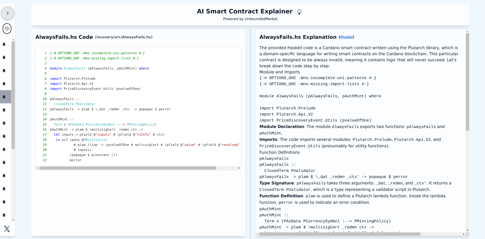
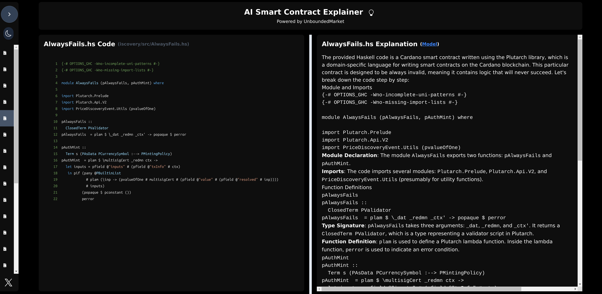

# AI Explainer Interface

Welcome to the **AI Explainer Interface**, an open-source project by **UnboundedMarket**.  
This interface visualizes Cardano smart contracts and their corresponding LLM-generated explanations.  

For details about the fine-tuned LLMs used in this project, visit the following repository:  
[**AI Smart Contract Explainer Models**](https://github.com/unboundedmarket/ai-sc-explainer-models.git).  


---

## Getting Started

### Prerequisites
Ensure you have the following installed:
- [Node.js](https://nodejs.org/) (version 14.x or later)
- [npm](https://www.npmjs.com/) (comes with Node.js)

### Installation

Clone the repository and navigate to the project directory:
```bash
git clone https://github.com/unboundedmarket/ai-sc-explainer-interface.git
cd ai-sc-explainer-interface
```

Install the required dependencies:
```bash
npm install
```

---

### Running the Application

Start the application in development mode:
```bash
npm start
```

Open your browser and visit [http://localhost:3000](http://localhost:3000) to view the interface.

---

### Building for Production

To create a production-ready build of the application:
```bash
npm run build
```

The built files will be available in the `build/` directory.

---

## Data Integration

To load the smart contract explanation data, place your JSON file in the following directory:
```
src/data/
```

Ensure the file is named appropriately as `smart_contract_explanation.json`.

Here’s the updated README with the **Interface Navigation** section, including placeholders for the screenshots:

---

## Interface Navigation

The AI Explainer Interface is designed for simplicity and ease of use.  
It includes two main themes: **Light Mode** and **Dark Mode**, which can be toggled via the sidebar.

### Key Features
1. **Smart Contract Visualization**: A display of Cardano smart contract code.
2. **AI Explanations Panel**: A display of the LLM-generated explanation.
3. **Theme Toggle**: Switch between Light and Dark modes.
4. **Search Bar**: Search for specific contracts or contract creators.
5. **Execution Flow**: User can generate an interactive execution flow diagram of the code. 
6.  **Further analysis**: User can use tree-sitter grammars to parse the code and view its syntax tree.

### Light Mode
  

### Dark Mode
  
